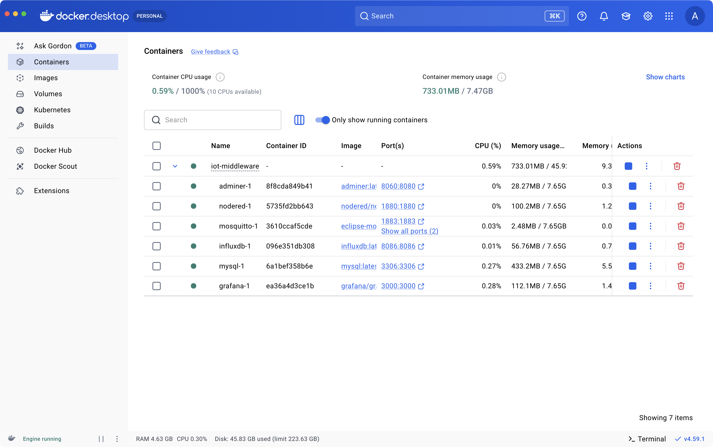

```
   __  ___        __     _         
  /  |/  /_ _____/ /_ __(_)__  ___ 
 / /|_/ / // / _  / // / / _ \/ _ \
/_/  /_/\_, /\_,_/\_,_/_/_//_/\___/
       /___/                       
ai.iot.education.solutions.marketplace ==================================================

Ts. Mohamad Ariffin Zulkifli
ariffin@myduino.com
```

# Docker IoT Middleware

This repository contains a skeleton to setup a remote server to become a powerful IoT middleware using [Docker Compose](https://docs.docker.com/compose/). It is built around the **MING** stack, a popular combination of open-source applications for IoT:

- **M** (MQTT) [Mosquitto](https://mosquitto.org/) for MQTT protocols
- **I** (InfluxDB) [InfluxDB](https://www.influxdata.com/) for time series database
- **N** (Node-RED) [Node-RED](https://nodered.org/) for Javascript low-code flow-based programming
- **G** (Grafana) [Grafana](https://grafana.com/) for interactive dashboard

Additionally, the stack includes:
- [MySQL](https://www.mysql.com/) for SQL database
- [Adminer](https://www.adminer.org/) for SQL database management system

In Docker, each application above is containerized into a single image and is readily available in [Docker Hub](https://hub.docker.com/). For example, everything you need to host Node-RED in a server including NodeJS and other libraries or dependencies is containerized as [nodered/node-red](https://hub.docker.com/r/nodered/node-red) image.

Docker Compose allows you to define your entire application stack in a single, easy-to-read configuration file called `docker-compose.yml`. In this file, you specify which containers should run, how they should be configured, and how they should connect to each other.

This repository contains the `docker-compose.yml` with definition of the stack of applications stated above so you can easily setup an IoT middleware.

**Disclaimer:** Please use this `docker-compose.yml` file as a starting point for training and testing
but keep in mind that for production usage it might need modifications, especially on security.

## Directory layout

* `docker-compose.yml`: the docker-compose file containing the services
* `configuration/mosquitto`: directory containing the Mosquitto (MQTT broker) configuration
* `configuration/nodered`: directory containing the Node-RED configuration

## Installation

**Prerequisites:** [Git](https://git-scm.com/) must be installed on your system.

Choose the installation guide that matches your platform:

### Option 1: PC or Mac (Docker Desktop)

1. Download and install [Docker Desktop](https://www.docker.com/products/docker-desktop/) for your operating system (Windows or Mac).

2. Make sure Docker Desktop is running.

3. Open Terminal (Mac) or PowerShell (Windows) and clone this repository.
```bash
git clone https://github.com/ariffinzulkifli/iot-middleware.git
```

4. Change your working directory to the cloned repository directory.
```bash
cd iot-middleware
```

5. Launch the Docker Compose services in detached mode.
```bash
docker compose up -d
```
Wait until all containers is successfully `Started` like below.

```
[+] Running 6/6
 ✔ Container iot-middleware-nodered-1    Running            0.0s
 ✔ Container iot-middleware-mosquitto-1  Running            0.0s
 ✔ Container iot-middleware-influxdb-1   Running            0.0s
 ✔ Container iot-middleware-grafana-1    Running            0.0s
 ✔ Container iot-middleware-mysql-1      Running            0.0s
 ✔ Container iot-middleware-adminer-1    Running            0.0s
```

6. Verify the containers are running in Docker Desktop.



You can also verify the containers using command like below:
```bash
docker compose ps
```

```
NAME                         IMAGE                      COMMAND                  SERVICE     CREATED          STATUS                    PORTS
iot-middleware-adminer-1     adminer:latest             "entrypoint.sh docke…"   adminer     12 minutes ago   Up 12 minutes             0.0.0.0:8060->8080/tcp
iot-middleware-grafana-1     grafana/grafana:latest     "/run.sh"                grafana     12 minutes ago   Up 12 minutes             0.0.0.0:3000->3000/tcp
iot-middleware-influxdb-1    influxdb:latest            "/entrypoint.sh infl…"   influxdb    12 minutes ago   Up 12 minutes (healthy)   0.0.0.0:8086->8086/tcp
iot-middleware-mosquitto-1   eclipse-mosquitto:latest   "/docker-entrypoint.…"   mosquitto   12 minutes ago   Up 12 minutes             0.0.0.0:1883->1883/tcp, 0.0.0.0:9001->9001/tcp
iot-middleware-mysql-1       mysql:latest               "docker-entrypoint.s…"   mysql       12 minutes ago   Up 11 minutes             0.0.0.0:3306->3306/tcp
iot-middleware-nodered-1     nodered/node-red:latest    "./entrypoint.sh"        nodered     12 minutes ago   Up 12 minutes (healthy)   0.0.0.0:1880->1880/tcp
```

```bash
docker compose logs
```

### Option 2: Raspberry Pi (Terminal)

Here is the guide to install Docker on a 64-bit version of Debian Bullseye, Bookworm or Trixie running on your Raspberry Pi. If you are unsure, you can check the architecture using the `dpkg --print-architecture` command.

1. Update the package list and install the required dependencies:
```bash
sudo apt update
sudo apt install ca-certificates curl
```

2. Add Docker's official GPG key:
```bash
sudo install -m 0755 -d /etc/apt/keyrings
sudo curl -fsSL https://download.docker.com/linux/debian/gpg -o /etc/apt/keyrings/docker.asc
sudo chmod a+r /etc/apt/keyrings/docker.asc
```

3. Add the Docker repository to your package sources:
```bash
sudo tee /etc/apt/sources.list.d/docker.sources <<EOF
Types: deb
URIs: https://download.docker.com/linux/debian
Suites: $(. /etc/os-release && echo "$VERSION_CODENAME")
Components: stable
Signed-By: /etc/apt/keyrings/docker.asc
EOF
```

4. Update the package list and install Docker:
```bash
sudo apt update
sudo apt install docker-ce docker-ce-cli containerd.io docker-buildx-plugin docker-compose-plugin -y
```

5. Clone this repository.
```bash
git clone https://github.com/ariffinzulkifli/iot-middleware.git
```

6. Change your working directory to the cloned repository directory.
```bash
cd ~/iot-middleware
```

7. Launch the Docker Compose services in detached mode.
```bash
sudo docker compose up -d
```
Wait until all containers is successfully `Started` like below.

```
[+] Running 13/13
 ✔ Image eclipse-mosquitto:latest       Pulled            37.7s
 ✔ Image nodered/node-red:latest        Pulled            114.9s
 ✔ Image mysql:latest                   Pulled            120.5s
 ✔ Image influxdb:latest                Pulled            67.8s
 ✔ Image grafana/grafana:latest         Pulled            104.1s
 ✔ Image adminer:latest                 Pulled            70.4s
 ✔ Network iot-middleware_iotstack      Created            0.3s
 ✔ Container iot-middleware-mysql-1     Created            4.1s
 ✔ Container iot-middleware-influxdb-1  Created            4.1s
 ✔ Container iot-middleware-adminer-1   Created            4.3s
 ✔ Container iot-middleware-grafana-1   Created            4.3s
 ✔ Container iot-middleware-nodered-1   Created            4.3s
 ✔ Container iot-middleware-mosquitto-1 Created            4.3s
```

You can now access the services from your Raspberry Pi using `localhost` or from other devices on the same network using the Raspberry Pi hostname or IP address. For example, Node-RED can be accessed at http://localhost:1880 or http://pi5.local:1880.

### Option 3: VPS Cloud Server (GBCloud)

#### Create Account on GBCloud

1. Click the `Create account` link on [GBCloud](https://billing.gbcloud.net/aff.php?aff=87) login page.
2. Fill in your `Personal Information`, `Billing Address`, `Additional Information` and `Account Security`.
3. Check the `I have read and agree to the Terms of Service`. and click the `Register` button.

#### Remote SSH Ubuntu Server

1. Open Terminal on your PC.

**Note:** You can use any suitable software such as [PowerShell](https://learn.microsoft.com/en-us/powershell/scripting/install/installing-powershell-on-windows), [PuTTY](https://www.chiark.greenend.org.uk/~sgtatham/putty/latest.html), [Cmder](https://github.com/cmderdev/cmder), etc.

2. Use the SSH command to connect to the remote server.

**Note:** change the `ip-address` with your server ip-address.
```bash
ssh root@ip-address
```
**Note:** When you attempt to connect for the first time, SSH will display the authenticity message you provided. It shows the server's fingerprint, which is a unique identifier for the server's SSH key. You need to verify this fingerprint to ensure you're connecting to the correct server. Type in `yes` to continue.

```bash
The authenticity of host 'ip-address (ip-address)' can't be established.
ED25519 key fingerprint is SHA256:oUuTnMQM2qCp7Oqip8gBpclMRBJFbL/hbQR5kbQnNOk.
This key is not known by any other names.
Are you sure you want to continue connecting (yes/no/[fingerprint])?
```

3. After confirming the authenticity of the server, SSH will prompt you to enter your password to log in.
```bash
root@ip-address's password:
```

If you provided the correct credentials, you should now be logged into the remote server, and you can start using it. You'll see the Ubuntu server terminal as below.

```
Welcome to Ubuntu 22.04.1 LTS (GNU/Linux 5.15.0-52-generic x86_64)

 * Documentation:  https://help.ubuntu.com
 * Management:     https://landscape.canonical.com
 * Support:        https://ubuntu.com/advantage

  System information as of Tue Oct 17 19:21:02 +08 2023

  System load:           0.1962890625
  Usage of /:            3.7% of 48.27GB
  Memory usage:          10%
  Swap usage:            0%
  Processes:             95
  Users logged in:       0
  IPv4 address for eth0: ipv4-ipaddress
  IPv6 address for eth0: ipv6-ipaddress


0 updates can be applied immediately.


The list of available updates is more than a week old.
To check for new updates run: sudo apt update

Last login: Tue Nov  1 15:31:57 2022 from 104.208.107.150
root@iot-middleware:~#
```

#### Docker Installation

1. Update the package list to ensure you have the latest information about available packages.
```bash
sudo apt update
```

2. Install the necessary packages and dependencies for Docker.
```bash
sudo apt install apt-transport-https ca-certificates curl software-properties-common
```

3. Add Docker's GPG key to your system.
```bash
curl -fsSL https://download.docker.com/linux/ubuntu/gpg | sudo gpg --dearmor -o /usr/share/keyrings/docker-archive-keyring.gpg
```

4. Add the Docker repository to your system's sources list.
```bash
echo "deb [arch=$(dpkg --print-architecture) signed-by=/usr/share/keyrings/docker-archive-keyring.gpg] https://download.docker.com/linux/ubuntu $(lsb_release -cs) stable" | sudo tee /etc/apt/sources.list.d/docker.list > /dev/null
```

5. Update the package list once more to include Docker repository information.
```bash
sudo apt update
```

6. Check the available Docker packages and their versions.
```bash
apt-cache policy docker-ce
```

You'll see the output like below, although the version number for Docker may be different:
```
docker-ce:
  Installed: (none)
  Candidate: 5:20.10.14~3-0~ubuntu-jammy
  Version table:
     5:20.10.14~3-0~ubuntu-jammy 500
        500 https://download.docker.com/linux/ubuntu jammy/stable amd64 Packages
     5:20.10.13~3-0~ubuntu-jammy 500
        500 https://download.docker.com/linux/ubuntu jammy/stable amd64 Packages
```

7. Install Docker using the following command.
```bash
sudo apt install docker-ce
```

8. Check the status of the Docker service to verify that it's running.
```bash
sudo systemctl status docker
```

You'll see the output like below, showing that the service is active and running:
```
Output
● docker.service - Docker Application Container Engine
     Loaded: loaded (/lib/systemd/system/docker.service; enabled; vendor preset: enabled)
     Active: active (running) since Fri 2022-04-01 21:30:25 UTC; 22s ago
TriggeredBy: ● docker.socket
       Docs: https://docs.docker.com
   Main PID: 7854 (dockerd)
      Tasks: 7
     Memory: 38.3M
        CPU: 340ms
     CGroup: /system.slice/docker.service
             └─7854 /usr/bin/dockerd -H fd:// --containerd=/run/containerd/containerd.sock
```
Hold `Ctrl + C` on keyboard to exit the status back to terminal prompt.

#### Docker Compose Installation

1. Make sure the directory where Docker Compose should be installed exists. This command creates the necessary directory if it doesn't exist.
```bash
mkdir -p ~/.docker/cli-plugins/
```

2. Download the Docker Compose binary to the specified directory.
```bash
curl -SL https://github.com/docker/compose/releases/download/v2.38.2/docker-compose-linux-x86_64 -o ~/.docker/cli-plugins/docker-compose
```

3. Make the downloaded Docker Compose binary executable.
```bash
chmod +x ~/.docker/cli-plugins/docker-compose
```

4. Check the Docker Compose version to verify that it's installed correctly.
```bash
docker compose version
```

You'll see output like below, showing that Docker Compose is successfully installed with stated version:
```
Output
Docker Compose version v2.38.2
```

#### Clone and Run

1. Clone this repository into your server.
```bash
git clone https://github.com/ariffinzulkifli/iot-middleware.git
```

2. Change your working directory to the cloned repository directory.
```bash
cd ~/iot-middleware
```

3. Launch the Docker Compose services in detached mode.
```bash
docker compose up -d
```
Wait until all containers is successfully `Started` like below.

```
[+] Running 6/6
 ✔ Container iot-middleware-nodered-1    Running            0.0s
 ✔ Container iot-middleware-mosquitto-1  Running            0.0s
 ✔ Container iot-middleware-influxdb-1   Running            0.0s
 ✔ Container iot-middleware-grafana-1    Running            0.0s
 ✔ Container iot-middleware-mysql-1      Running            0.0s
 ✔ Container iot-middleware-adminer-1    Running            0.0s
```

4. Verify that the Docker Compose containers are running.
```bash
docker compose ps
```

```
NAME                         IMAGE                      COMMAND                  SERVICE     CREATED          STATUS                    PORTS
iot-middleware-adminer-1     adminer:latest             "entrypoint.sh docke…"   adminer     12 minutes ago   Up 12 minutes             0.0.0.0:8060->8080/tcp
iot-middleware-grafana-1     grafana/grafana:latest     "/run.sh"                grafana     12 minutes ago   Up 12 minutes             0.0.0.0:3000->3000/tcp
iot-middleware-influxdb-1    influxdb:latest            "/entrypoint.sh infl…"   influxdb    12 minutes ago   Up 12 minutes (healthy)   0.0.0.0:8086->8086/tcp
iot-middleware-mosquitto-1   eclipse-mosquitto:latest   "/docker-entrypoint.…"   mosquitto   12 minutes ago   Up 12 minutes             0.0.0.0:1883->1883/tcp, 0.0.0.0:9001->9001/tcp
iot-middleware-mysql-1       mysql:latest               "docker-entrypoint.s…"   mysql       12 minutes ago   Up 11 minutes             0.0.0.0:3306->3306/tcp
iot-middleware-nodered-1     nodered/node-red:latest    "./entrypoint.sh"        nodered     12 minutes ago   Up 12 minutes (healthy)   0.0.0.0:1880->1880/tcp
```

5. View the logs of the Docker Compose containers to monitor their output and any potential issues.
```bash
docker compose logs
```

### Running Specific Containers

**Note:** If you would like to run a specific service only, such as `nodered`:
```bash
docker compose up -d nodered
```

or several services such as `nodered`, `mysql` and `adminer`:
```bash
docker compose up -d nodered mysql adminer
```

or several services such as `nodered`, `mosquitto` and `influxdb`:
```bash
docker compose up -d nodered mosquitto influxdb
```

## Usage

After all the Docker containers have been sucessfully initialized and started, you should be able
to access the applications in your browser.

**Note:** change the `ip-address` with your server hostname or ip-address.

Mosquitto MQTT broker can be access by it's configuration below:
  - host: `ip-address`
  - protocol: TCP (port: 1883)
  - protocol: Websockets (port: 9001)
  - username: admin
  - password: password

- InfluxDB http://`ip-address`:8086
  - username: admin
  - password: password
  - bucket name: iot-sensors
  - organisation name: my-organisation
  - admin token: A8C2B071-35F6-43F8-9F51-C5F584B2366B
- Node-RED http://`ip-address`:1880
  - username: admin
  - password: password
- Grafana http://`ip-address`:3000
  - username: admin
  - password: password

MySQL database can be access by it's configuration below:
  - host: `ip-address`
  - port: 3306
  - username: root
  - password: password

- Adminer http://`ip-address`:8060
  - username: root
  - password: password